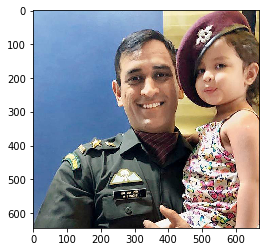
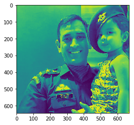
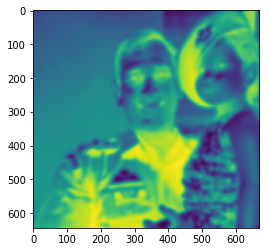
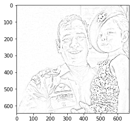

```python
import imageio
import numpy as np
import matplotlib.pyplot as plt
import scipy.ndimage
import cv2 as cv
```


```python
def grayscale(rgb):
    return np.dot(rgb[...,:3], [0.199, 0.287, 0.214])    
```


```python
img_src="https://images.mid-day.com/images/2018/apr/Dhoni-Ziva.jpg"
img=imageio.imread(img_src)
gray_image=grayscale(img)
inverted_image=255-gray_image
```


```python
#original image
plt.imshow(img)
```


    <matplotlib.image.AxesImage at 0x7fe444c35748>





```python
#gray_image
plt.imshow(gray_image)
```


    <matplotlib.image.AxesImage at 0x7fe44435b198>





```python
#inverted_image
plt.imshow(inverted_image)
```


    <matplotlib.image.AxesImage at 0x7fe444333b70>


```python
#blur image
blur_image=scipy.ndimage.filters.gaussian_filter(inverted_image, sigma=5)
plt.imshow(blur_image)
```


    <matplotlib.image.AxesImage at 0x7fe4442917b8>





```python
def dodge(front, back):
    result=front*255/(255-back)
    result[result > 255]=255
    result[back==255]=255
    return result.astype('uint8')
```


```python
sketched_image=dodge(blur_image, gray_image)
plt.imshow(sketched_image, cmap="gray")
```


    <matplotlib.image.AxesImage at 0x7fe4442731d0>





```python
cv.imwrite("sketch.jpeg", sketched_image)
```


    True


